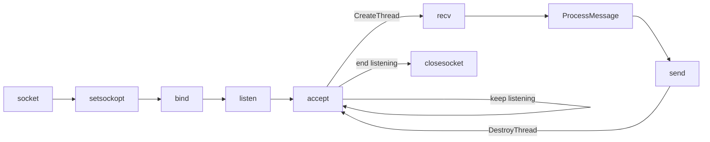
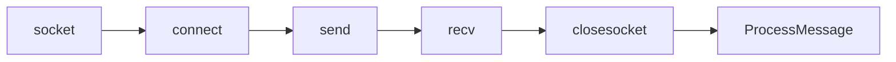

# Tcp Socket
## How to build
```
gcc -o [exe_file] [.c file]... -lWs2_32
```
## Flow of processing
### Server

### Client

## Protocol
- Type: integer, name: command
- Type: integer, name: data length
- Type: void *, name: data buffer
- Command values: \
    0 Null \
    1 Register a device \
    10 To end server
## Firewall Settings
```
Copilot:Your socket-based IoT simulation program looks interesting! For your TCP
and multicast parts to work smoothly, you\'ll need to configure your
firewall settings appropriately. Here are some suggestions:
```
### Firewall Settings for TCP
1.  **Allow TCP Traffic**:
    -   Create inbound and outbound rules to allow TCP traffic on the
        specific ports your application uses. For example, if your
        server listens on port 8080, allow TCP traffic on port 8080.
2.  **Allow ICMP (Ping)**:
    -   Ensure ICMP traffic is allowed for troubleshooting purposes.
        This can help you verify connectivity between devices.
3.  **Application-Specific Rules**:
    -   If your program is identified by a specific executable, create
        rules that allow all necessary traffic for that executable.
### Example Firewall Rules for Windows 11
4.  **Inbound Rule for TCP**:
    -   Open **Windows Defender Firewall with Advanced Security**.
    -   Go to **Inbound Rules** \> **New Rule**.
    -   Select **Port** and click **Next**.
    -   Choose **TCP** and specify the port number (e.g., 8080).
    -   Allow the connection and apply the rule to all profiles (Domain,
        Private, Public).
    -   Name the rule (e.g., \"Allow TCP 8080\") and finish.
5.  **Outbound Rule for TCP**:
    -   Follow the same steps as above but create the rule under
        **Outbound Rules**.
6.  **Allow ICMP**:
    -   Go to **Inbound Rules** \> **New Rule**.
    -   Select **Custom** and click **Next**.
    -   Choose **All programs** and click **Next**.
    -   Select **ICMPv4** from the protocol type dropdown.
    -   Allow the connection and apply the rule to all profiles.
    -   Name the rule (e.g., \"Allow ICMPv4\") and finish.
### Firewall Settings for Multicast
7.  **Allow Multicast Traffic**:
    -   Multicast traffic typically uses UDP. Create rules to allow UDP
        traffic on the specific multicast address and port your
        application uses.
8.  **Example Multicast Rule**:
    -   Open **Windows Defender Firewall with Advanced Security**.
    -   Go to **Inbound Rules** \> **New Rule**.
    -   Select **Custom** and click **Next**.
    -   Choose **All programs** and click **Next**.
    -   Select **UDP** from the protocol type dropdown.
    -   Specify the local and remote IP addresses (e.g., 224.0.0.0/4 for
        multicast).
    -   Allow the connection and apply the rule to all profiles.
    -   Name the rule (e.g., \"Allow Multicast UDP\") and finish.
By setting up these rules, you should be able to ensure smooth
communication for your IoT simulation program. If you need further
assistance with the multicast part or any other aspect, feel free to
share the rest of your code!

來源

1\. [Prepare Your Firewall for IoT Security - Palo Alto
Networks](https://docs.paloaltonetworks.com/iot/iot-security-admin/get-started-with-iot-security/prepare-your-firewall-for-iot-security)

2\. [Firewall For IoT Devices: Enhance Your Smart Home Security -
Reolink](https://reolink.com/blog/firewall-for-iot-devices/)

3\. [What is Firewall in IoT? Understanding Its Role and
Importance](https://softteco.com/blog/what-is-iot-firewall)
```
Copilot:Your multicast code looks solid! To ensure your program works smoothly,
you\'ll need to configure your firewall settings to allow multicast UDP
traffic. Here are the steps to set up the appropriate firewall rules on
Windows 11:
```
### Firewall Settings for Multicast UDP Traffic
1.  **Allow UDP Traffic for Multicast**:
    -   Create inbound and outbound rules to allow UDP traffic on the
        specific multicast address and port your application uses.
### Example Firewall Rules for Windows 11
2.  **Inbound Rule for Multicast UDP**:
    -   Open **Windows Defender Firewall with Advanced Security**.
    -   Go to **Inbound Rules** \> **New Rule**.
    -   Select **Custom** and click **Next**.
    -   Choose **All programs** and click **Next**.
    -   Select **UDP** from the protocol type dropdown.
    -   Specify the local port (e.g., 12345) and remote IP address
        (e.g., 239.0.0.1).
    -   Allow the connection and apply the rule to all profiles (Domain,
        Private, Public).
    -   Name the rule (e.g., \"Allow Multicast UDP Inbound\") and
        finish.
3.  **Outbound Rule for Multicast UDP**:
    -   Follow the same steps as above but create the rule under
        **Outbound Rules**.
### Additional Tips
-   **Check Network Adapter Settings**:
    -   Ensure that your network adapter settings are configured to
        support multicast. Sometimes, virtual machine network adapters
        can interfere with multicast
        traffic[**^4^**](https://www.youtube.com/watch?v=R__IQb1YGnM).
-   **Add Application to Firewall Exception List**:
    -   If you encounter issues, you can add your application to the
        Windows Firewall exception list to allow all incoming traffic
        for that
        application[**^5^**](https://www.youtube.com/watch?v=C_WlAIZMjRw).
By setting up these rules, you should be able to ensure smooth
communication for your multicast application. If you need further
assistance or have other questions, feel free to ask! 😊
[**^4^**](https://www.youtube.com/watch?v=R__IQb1YGnM): [Enable
Multicast in Firewall on Windows
10](https://windowsreport.com/firewall-blocking-multicast/)
[**^5^**](https://www.youtube.com/watch?v=C_WlAIZMjRw): [A client may
not be able to connect to multicast
streams](https://support.microsoft.com/en-us/topic/a-client-may-not-be-able-to-connect-to-multicast-streams-or-to-other-user-datagram-protocol-streams-through-windows-firewall-by-using-windows-media-player-5f604764-3081-de5c-a522-a0a56e9d0adc)

來源

1\. [Enable Multicast in Firewall on Windows 10 \[How
to\]](https://windowsreport.com/firewall-blocking-multicast/)

2\. [A client may not be able to connect to multicast streams or to
other User Datagram Protocol streams through Windows Firewall by using
Windows
\...](https://support.microsoft.com/en-us/topic/a-client-may-not-be-able-to-connect-to-multicast-streams-or-to-other-user-datagram-protocol-streams-through-windows-firewall-by-using-windows-media-player-5f604764-3081-de5c-a522-a0a56e9d0adc)

3\. [How to Open UDP Port in Windows 10
Firewall](https://www.youtube.com/watch?v=aHxXXaoBj9k)

4\. [How to Open UDP Port in Windows 11
Firewall](https://www.youtube.com/watch?v=R__IQb1YGnM)

5\. [Configure the Windows Firewall to allow only specific IP Address to
connect your port \| VPS
Tutorial](https://www.youtube.com/watch?v=C_WlAIZMjRw)

6\. [Windows firewall settings to receive UDP and
pings](https://security.stackexchange.com/questions/159791/windows-firewall-settings-to-receive-udp-and-pings)

7\. [UDP communication is blocked by the Windows Firewall rule in WSFC -
Windows Server \| Microsoft
Learn](https://learn.microsoft.com/en-us/troubleshoot/windows-server/networking/windows-fireware-rule-block-udp-communication)


## References
[Differences between socket programming on Windows, Linux, and macOS](https://handsonnetworkprogramming.com/articles/differences-windows-winsock-linux-unix-bsd-sockets-compatibility/)
