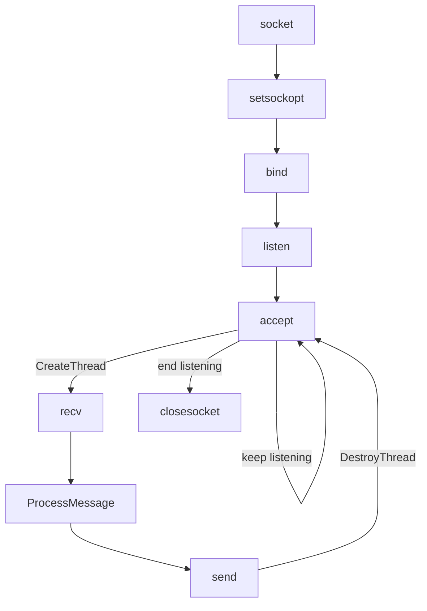
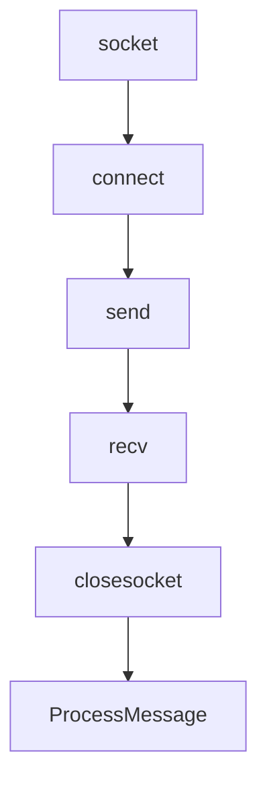

# A tcp socket client-server, flow of processing
## Server

```mermaid
graph TD;
    socket-->setsockopt
    setsockopt-->bind
    bind-->listen
    listen-->accept
    accept--CreateThread-->recv-->ProcessMessage-->send--DestroyThread-->accept
    accept--keep listening-->accept--end listening-->closesocket
```
## Client

```mermaid
graph TD;
    socket-->connect-->send-->recv-->closesocket-->ProcessMessage
```